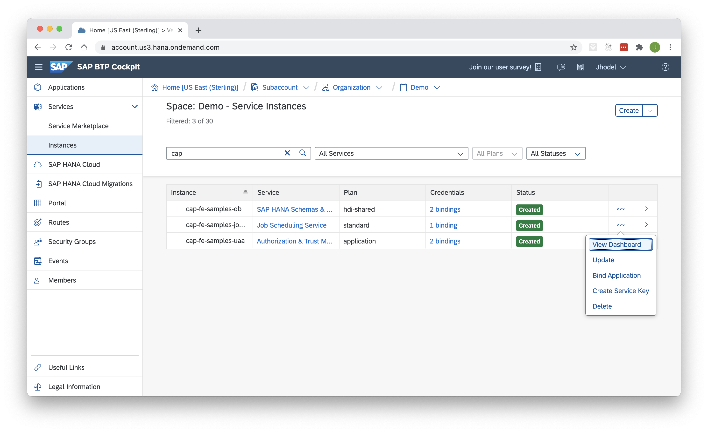
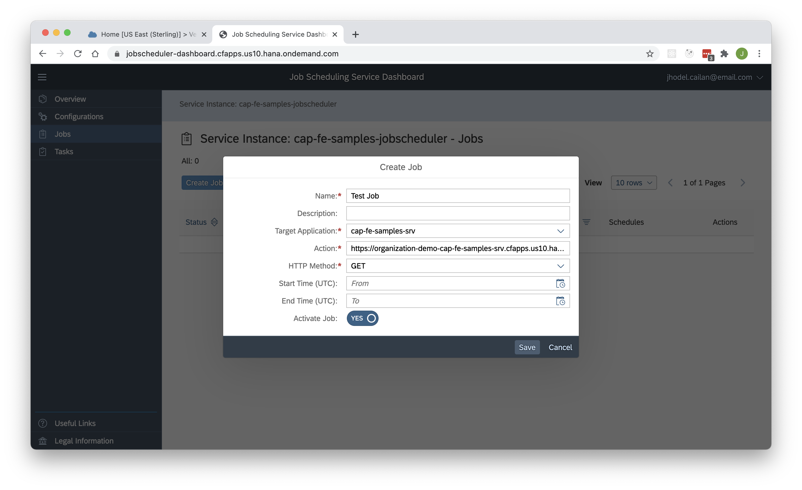
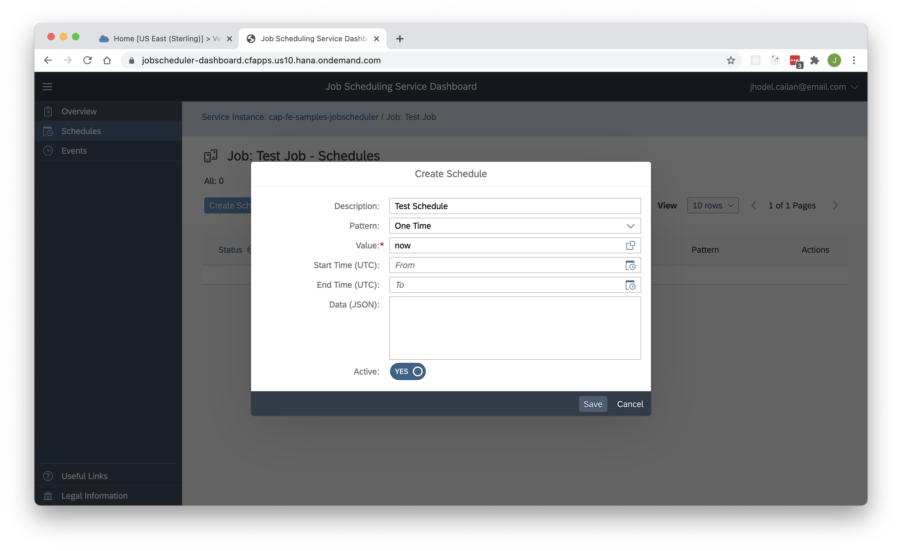
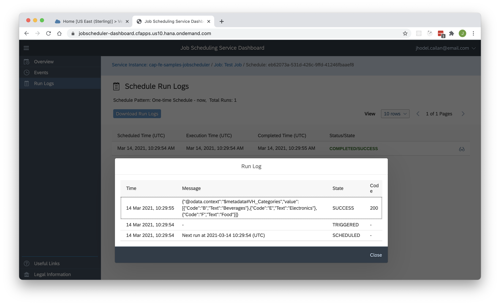

# Job Scheduling Service Demo

This branch hosts the demo project for SAP Job Scheduling Service of SAP Business Technology Platform (BTP).

## Prerequisites

- SAP BTP for the Cloud Foundry Environment
- Job Scheduling Service
- SAP HANA Cloud
- Authorization and Trust Management (UAA)

## Deployment to Cloud Foundry

- Build the MTA Project
```swift
> mbt build
```
- Deploy the MTA Project
```swift
> cf deploy mta_archives/cap-fe-samples_1.0.0.mtar
```

## Create a new Job Schedule
- From SAP BTP Cockpit > Services > Instances > Job Scheduling Service `cap-fe-samples-jobscheduler` > Select the action `View Dashboard`



- From the Job Scheduling Service Dashboard, create a new job



**Sample Action**

```shell
https://<organization>-<space>-cap-fe-samples-srv.cfapps.us10.hana.ondemand.com/northwind/VH_Categories
```

- From the newly created job, create a new schedule



- Check the run logs



**Expected Response**

```javascript
{
	"@odata.context": "$metadata#VH_Categories",
	"value": [
		{
			"Code": "B",
			"Text": "Beverages"
		},
		{
			"Code": "E",
			"Text": "Electronics"
		},
		{
			"Code": "F",
			"Text": "Food"
		}
	]
}
```